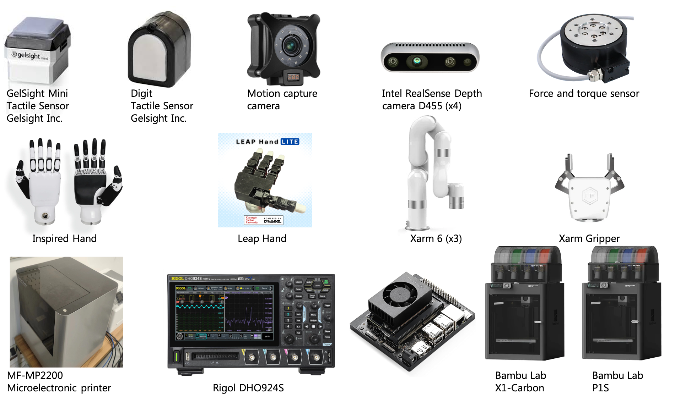

## Research

Our research interests include but are not limited to:

🖐️ **Tactile Sensing and Multimodal Perception**.   
We design novel **tactile sensors** and **multimodal sensing systems** (e.g., vision-tactile fusion) to equip robotic hands with human-like touch capabilities. Research spans sensor hardware development, signal processing algorithms, and applications in deformable object manipulation.

🧠 **Embodied Intelligence and Skill Learning**.   
We explore **reinforcement learning**, **imitation learning**, and **tactile-guided policy optimization** to enable robots to adaptively grasp, manipulate, and collaborate with humans in unstructured environments.

🤖 **Robotic Systems and Advanced End-effector Design**.  
From soft robotics to dexterous manipulators, we build **integrated robotic systems** with an emphasis on real-world applicability. Projects include dynamic control architectures, sensorimotor coordination, and hardware-software co-design for robust robotic operations.

🌐 **Human-robot Interaction**.   
We investigate **teleoperation interfaces**, **shared autonomy frameworks**, and **intuitive communication protocols** to bridge human intent with robotic execution. Applications range from industrial cobots to assistive robotics for healthcare scenarios.







### Equipments

🛠️ **Hardware Infrastructure**
- We have various robots, VR equipments, sensors, fabrication devices, etc. 

    

- Computational Power:

  - Students have 4090 desktops, 4 x Nvidia A40 server.

  - Besides, SIST have clusters for large-scale training.

### Teaching


