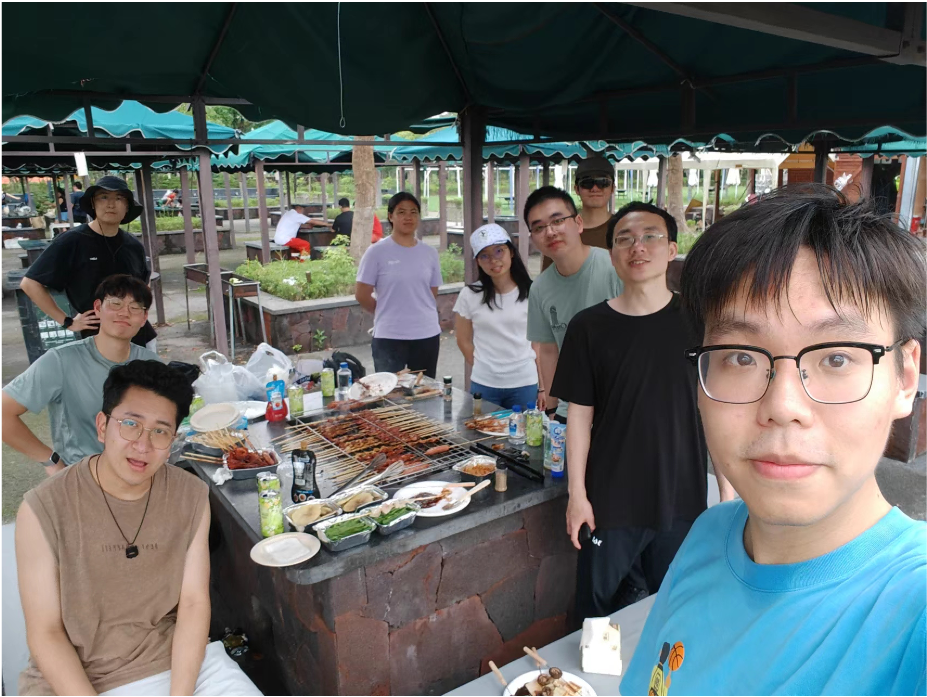
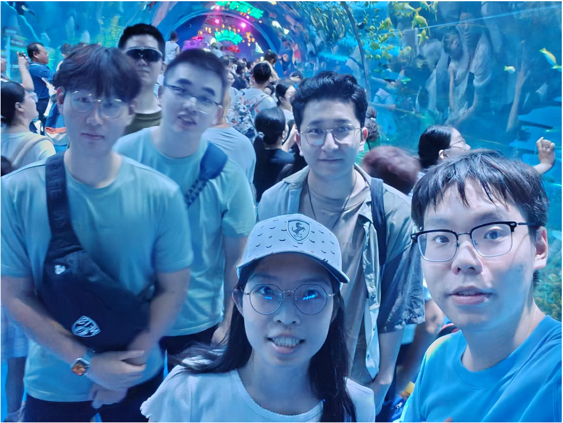
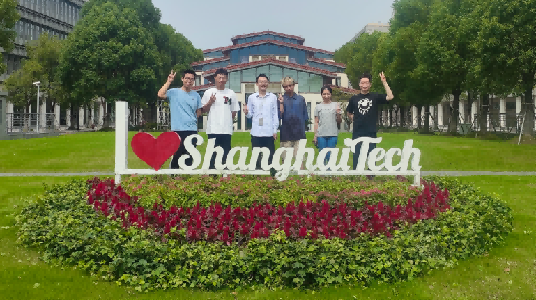

## Team



### Principal Investigator




### Students




    

        <!-- 2024 照片 -->
        
        
        
        
        
        <!-- 2023 照片 -->
        
        
        <!-- 复制图片实现无缝循环 -->
        
        
        
        
        
    

    

#### Alumni








